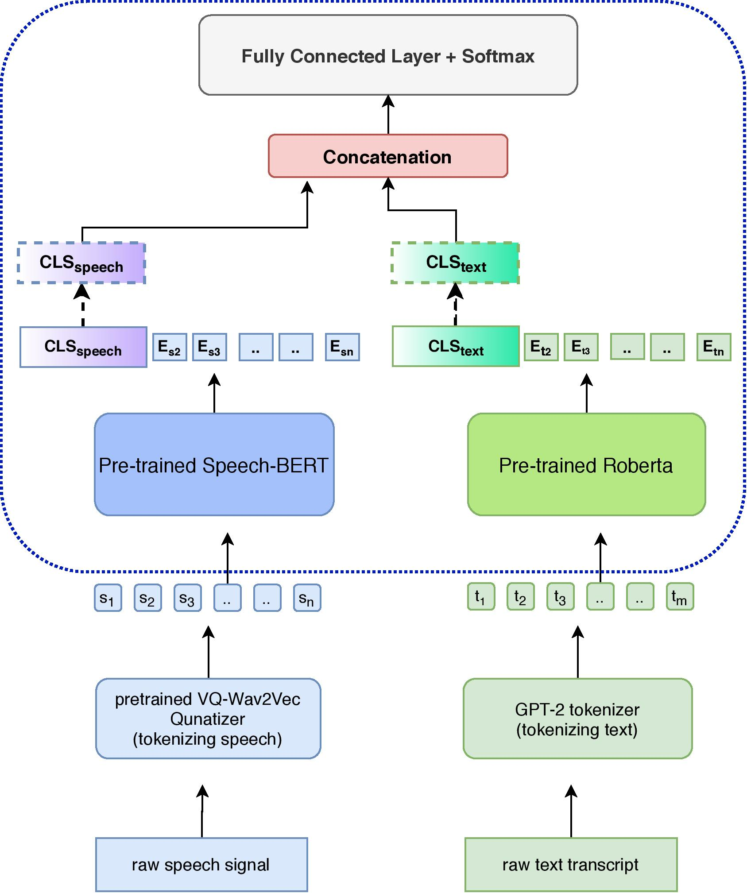

## Model Architecture

|Model name|Task  | Model file|
|---|---|---|
|Wav2Vec 2.0 Large 960h|audio to text| [download](https://dl.fbaipublicfiles.com/fairseq/wav2vec/wav2vec_big_960h.pt)
|VQ-Wav2Vec Kmeans|Speech Prediction |[download](https://dl.fbaipublicfiles.com/fairseq/wav2vec/vq-wav2vec_kmeans.pt)
|fine-tuned VQ-Wav2Vec Kmeans| Speech Training and Prediction | [download]() ADD LINK
|Roberta Base| Text Prediction| [download](https://dl.fbaipublicfiles.com/fairseq/models/roberta.base.tar.gz)
| fine-tuned Roberta Base| Text Training and Prediction|[download]() ADD LINK

## TODO

1. Train model to output only 1 emotion
2. Train model to output 3 scores, Arousal, Valence and Dominance and based on that get emotion by inference
3. Compare models

## Errors

file MSP-PODCAST_1023_0235.wav (in training_batch0) has assertion error, audiofile can't be tokenised correctly